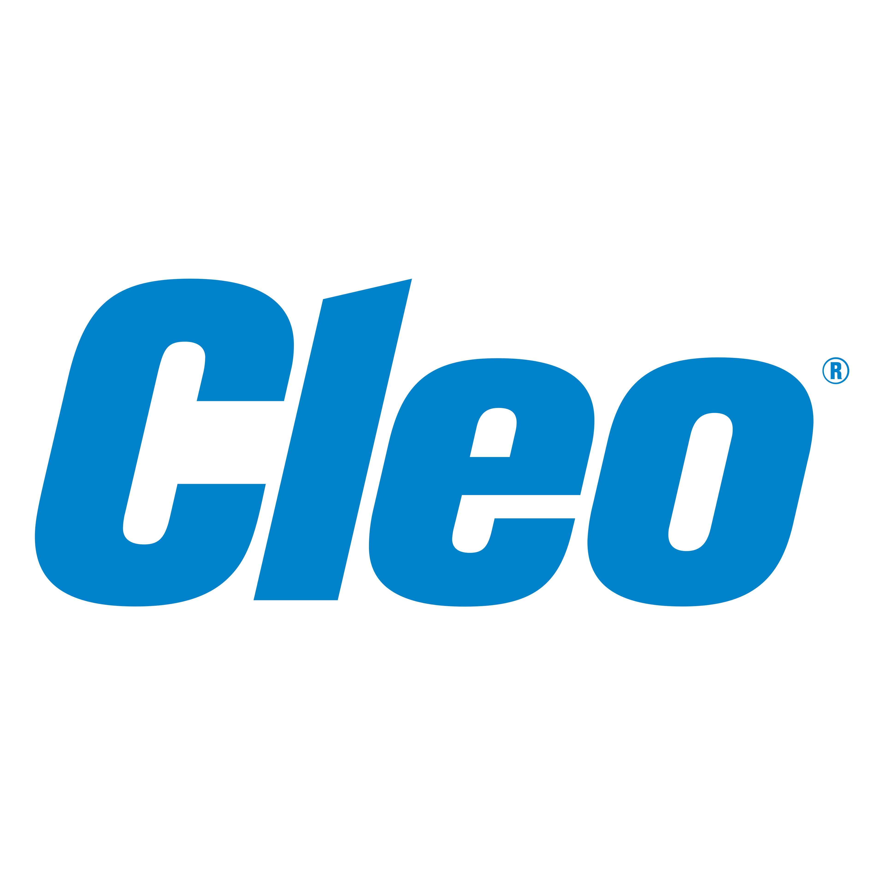

<p align="center">
  
</p>

<h1 align="center">Supply Chain Intelligence</h1>

<p align="center">
  A private, grounded AI assistant for EDI standards, supply chain operations,<br/>
  and Cleo integration — built on a production-grade RAG architecture with a fully local LLM.
</p>

<p align="center">
  
  
  
  
  
  
  
</p>

<br/>

<p align="center">
  
</p>

---

## What is this?

**Cleo Supply Chain Intelligence (CSCI)** is an internal AI assistant that answers questions about EDI standards, supply chain workflows, trading partner integrations, compliance rules, and Cleo's platform — grounded exclusively in your own ingested documents.

It does not rely on a cloud LLM. It does not hallucinate from general knowledge. If the answer isn't in your knowledge base, it says so — and it never calls the model at all in that case, saving compute and preventing confabulation.

The system was built from scratch using a **hybrid RAG architecture** — combining dense semantic search, sparse keyword matching, and reciprocal rank fusion — on top of a fully local inference stack.

---

## Architecture

```
  User Query
      │
      ▼
 ┌─────────────────────────────────────────────────────────┐
 │                    RETRIEVAL LAYER                      │
 │                                                         │
 │  QueryClassifier   ──►  Routes to 1–3 of 8 collections │
 │                                                         │
 │  ┌─────────────┐    ┌──────────────┐                   │
 │  │   Dense     │    │   Sparse     │                   │
 │  │ Retriever   │    │  Retriever   │                   │
 │  │             │    │              │                   │
 │  │ all-MiniLM  │    │  BM25Okapi   │                   │
 │  │  384-dim    │    │  (exact kw)  │                   │
 │  │  vectors    │    │    index     │                   │
 │  │  ChromaDB   │    │  .pkl file   │                   │
 │  │  HNSW ANN   │    │              │                   │
 │  └──────┬──────┘    └──────┬───────┘                   │
 │         └────────┬─────────┘                           │
 │                  ▼                                      │
 │         RRF Fusion  (k=60)                              │
 │         score = 1 / (60 + rank + 1)                     │
 └──────────────────┬──────────────────────────────────────┘
                    │
                    ▼
           Confidence Gate
        max_score < 0.35 ?
           │           │
          YES           NO
           │           │
           ▼           ▼
      Honest       Build prompt
      abstain      (context + query)
      (no LLM          │
       called)         ▼
                  phi3:mini
                  via Ollama
                  (local, Q4_0)
                       │
                       ▼
                 Cited answer
```

---

## Key Design Decisions

### 1. Hybrid Retrieval — Dense + Sparse + RRF

Most RAG systems use only dense (embedding-based) retrieval. That works well for natural language questions but fails badly on EDI — a domain full of exact codes like `AK5*R`, `ISA06`, `GS08`, `856 HL03="S"`. A semantic model has no signal on these strings.

This system fuses **both** retrieval strategies using **Reciprocal Rank Fusion**:

| Strategy | Model | Best for |
|---|---|---|
| Dense | `all-MiniLM-L6-v2` (384-dim, cosine) | Concept queries, paraphrases, semantic similarity |
| Sparse | `BM25Okapi` | Exact EDI codes, segment IDs, acronyms, error codes |
| Fusion | RRF (k=60) | Everything — best of both worlds, no learned weights |

RRF is parameter-free: `score = 1 / (60 + rank + 1)`. It can be computed at query time and requires no additional training.

### 2. Confidence Gate — The LLM Is Not Always Called

Before hitting the LLM, the system checks the maximum retrieval similarity score across all returned chunks. If it's below **0.35**, the context is too weak to ground a factual answer. In that case:

- The LLM is **never invoked** — no wasted ~8-30s of inference
- The user gets an honest "I don't have information on this" response
- Off-topic questions (`"capital of France?"`) are handled in ~300ms vs 10+ seconds

This is the difference between a RAG system that hallucinates when it doesn't know, and one that behaves like a reliable reference tool.

### 3. Semantic Chunking — Not Arbitrary Splits

Fixed-size chunking (split every N characters) destroys semantic units. This system splits at **meaningful boundaries** — paragraph breaks, numbered lists, EDI segment definitions (`ISA:`, `GS:`), and Markdown headers — then enforces a 512-token window with 64-token overlap.

The overlap is crucial: it preserves context across chunk boundaries so a question about a concept that spans two paragraphs doesn't miss half its answer.

### 4. Prompt Injection Defense

Retrieved chunks are wrapped in hard structural delimiters before being injected into the LLM context:

```
<<<BEGIN DOCUMENT CONTENT>>>
...chunk text...
<<<END DOCUMENT CONTENT>>>
```

The system prompt explicitly instructs the model to ignore any instruction-like text found inside document content. This neutralises the risk of adversarial text embedded in ingested documents hijacking the model's behaviour.

### 5. 8 Specialised Collections with Intelligent Routing

Rather than a single undifferentiated vector store, documents are organized into 8 domain-specific collections. A keyword-scoring classifier routes each query to the 1–3 most relevant collections before retrieval:

| Collection | Domain |
|---|---|
| `edi_standards` | X12 transaction sets, segments, acknowledgments |
| `supply_chain_concepts` | Forecasting, inventory, visibility, PO lifecycle |
| `integration_onboarding` | AS2, SFTP, VAN, map development, partner setup |
| `troubleshooting` | 997 rejections, transmission errors, encoding issues |
| `logistics_shipping` | Incoterms, freight modes, customs, carrier EDI |
| `compliance_regulations` | GDPR, DSCSA, GS1, retail chargeback prevention |
| `cleo_company` | Cleo Clarify capabilities, network, platform overview |
| `uploaded_documents` | Ad-hoc user uploads via the UI |

Routing prevents irrelevant collections from polluting the retrieval pool and improves both precision and latency.

---

## Tech Stack

| Layer | Technology | Why |
|---|---|---|
| Vector DB | ChromaDB 1.5.9 (HNSW, cosine) | Persistent, embedded, no infra required |
| Dense embeddings | `sentence-transformers/all-MiniLM-L6-v2` | 384-dim, fast, excellent for English domain text |
| Sparse index | `rank-bm25` (BM25Okapi) | Exact keyword recall for EDI codes and acronyms |
| Local LLM | `phi3:mini` via Ollama (3.8B, Q4_0) | Fits in 4GB VRAM; no cloud calls; deterministic at temp=0.1 |
| API backend | FastAPI + uvicorn | Async, typed, auto-documented, fast |
| Frontend | React 18 + custom CSS (design-system matched to Cleo brand) | Zero build toolchain; exact visual match to IntegrationCloud |
| Document loaders | pypdf, python-docx, pandas (Excel/CSV), BeautifulSoup | Covers all common enterprise formats |

---

## Project Structure

```
cleo-rag/
│
├── app/
│   ├── config.py                  # All constants — thresholds, model names, paths
│   ├── api.py                     # FastAPI backend — serves UI + REST endpoints
│   │
│   ├── ingestion/
│   │   ├── loaders.py             # PDF, DOCX, TXT, Excel, CSV, URL loaders
│   │   ├── chunker.py             # Semantic boundary chunker (512 tokens, 64 overlap)
│   │   ├── embedder.py            # Singleton sentence-transformer wrapper
│   │   └── pipeline.py            # Orchestrates Load → Chunk → Embed → Store
│   │
│   ├── database/
│   │   └── chroma.py              # ChromaDB client — collections, HNSW indexing
│   │
│   ├── retrieval/
│   │   ├── dense.py               # Dense retrieval adapter (ChromaDB query)
│   │   ├── sparse.py              # BM25 index — persistent .pkl, stopword filtering
│   │   ├── hybrid.py              # RRF fusion — merges dense + sparse ranked lists
│   │   ├── classifier.py          # Keyword-score query router → collection selection
│   │   └── context.py             # Full pipeline: classify → embed → retrieve → dedup
│   │
│   └── generation/
│       ├── llm.py                 # Ollama client singleton (handles API format variants)
│       ├── prompts.py             # System prompt, injection defense, context assembly
│       └── generator.py           # Confidence gate + LLM call + source extraction
│
├── frontend/                      # React UI — exact Cleo brand implementation
│   ├── index.html
│   ├── assets/cleo-logo.png
│   └── app/
│       ├── styles.css             # Full design system (CSS custom properties)
│       ├── icons.js               # Inline SVG icon set
│       ├── data.js                # Static data (collection metadata, suggestions)
│       ├── api.js                 # Live API client (query, ingest, stats, health)
│       ├── chrome.jsx             # TopNav + Sidebar with real file upload
│       ├── chat.jsx               # Chat area — bubbles, streaming, metadata row
│       ├── panel.jsx              # Right panel — chunks, sources, metadata tabs
│       └── app.jsx                # Root — health polling, stats refresh, state
│
├── scripts/
│   ├── ingest_corpus.py           # CLI: bulk ingest from data/raw/<collection>/
│   ├── generate_corpus.py         # Generate synthetic knowledge base via Claude API
│   └── reset_db.py                # Wipe ChromaDB + BM25 indexes for clean rebuild
│
├── data/
│   ├── raw/                       # Drop documents here by collection subfolder
│   ├── processed/
│   └── synthetic_qa/
│
├── tests/                         # Unit + integration tests for each layer
└── requirements.txt
```

---

## Getting Started

### Prerequisites

- Python 3.12
- [Ollama](https://ollama.com) installed and running
- `phi3:mini` model pulled

```bash
ollama pull phi3:mini
ollama serve          # keep this running in a separate terminal
```

### Installation

```bash
# 1. Create and activate virtual environment
python -m venv venv
venv\Scripts\activate          # Windows
# source venv/bin/activate     # macOS/Linux

# 2. Install dependencies
pip install --only-binary :all: "chromadb>=0.5.3"
pip install -r requirements.txt

# 3. Set environment variables
cp .env.example .env
# Add ANTHROPIC_API_KEY if using synthetic corpus generation
```

### Run

```bash
# Set Python path and start the API + UI server
$env:PYTHONPATH = "path/to/cleo-rag"
uvicorn app.api:app --reload --port 8000
```

Open **http://localhost:8000** — the UI loads automatically.

### Ingest Your Documents

**Option A — Drop files in `data/raw/` and run the CLI:**
```bash
# Place files in the matching collection subfolder:
#   data/raw/edi_standards/X12_Guide.pdf
#   data/raw/troubleshooting/common_errors.docx

python scripts/ingest_corpus.py --dry-run   # preview what will be ingested
python scripts/ingest_corpus.py             # ingest everything
```

**Option B — Drag and drop directly in the UI:**
Select a collection in the sidebar, drop your file, done.

**Option C — Generate a synthetic knowledge base (no files needed):**
```bash
# Requires ANTHROPIC_API_KEY in .env
python scripts/generate_corpus.py
# Generates 37 expert articles across all 8 collections using claude-haiku-4-5
```

---

## REST API

The FastAPI backend is self-documenting at **http://localhost:8000/docs**.

| Method | Endpoint | Description |
|---|---|---|
| `POST` | `/api/query` | Ask a question — returns answer, confidence, sources, chunks |
| `POST` | `/api/ingest` | Upload and ingest a document (multipart, max 50MB) |
| `GET` | `/api/stats` | Chunk counts per collection |
| `GET` | `/api/health` | Model availability + DB status |
| `GET` | `/api/collections` | List all collections with descriptions |

**Query example:**
```bash
curl -X POST http://localhost:8000/api/query \
  -H "Content-Type: application/json" \
  -d '{"query": "What does AK5*R mean in a 997 acknowledgment?"}'
```

**Response:**
```json
{
  "answer": "In an X12 997 Functional Acknowledgment, AK5*R means the transaction set has been rejected...",
  "sources": ["edi_standards_batch1.txt"],
  "confidence": 0.824,
  "confident": true,
  "collections_searched": ["edi_standards", "troubleshooting"],
  "chunks_used": 4,
  "chunks": [...]
}
```

---

## How Retrieval Works — Step by Step

```
1. CLASSIFY
   Query → keyword scoring against 8 collection signal dictionaries
   → top 1–3 collections selected (score must be ≥30% of best match)

2. EMBED
   Query text → all-MiniLM-L6-v2 → 384-dimensional unit vector (L2-normalized)
   (computed once, reused across all collection searches)

3. DENSE SEARCH  per collection
   Query vector → ChromaDB HNSW → top-5 nearest neighbours (cosine similarity)
   score = 1 - cosine_distance    (higher = more relevant)

4. SPARSE SEARCH  per collection
   Query → tokenize (lowercase, remove stopwords) → BM25Okapi scoring
   → all chunks with score > 0 returned

5. HYBRID FUSION  per collection
   Dense ranked list + Sparse ranked list → RRF (k=60)
   score_i = 1/(60 + dense_rank_i + 1) + 1/(60 + sparse_rank_i + 1)
   BM25 rescue threshold: sparse score ≥ 0.5 elevates chunks below density filter

6. MERGE + DEDUP  across collections
   All per-collection results merged, deduplicated on text[:150], sorted by RRF score

7. CONFIDENCE GATE
   max(dense_score) < 0.35 → return NO_CONTEXT_RESPONSE (LLM not called)
   max(dense_score) ≥ 0.35 → proceed to generation

8. GENERATE
   Top-4 chunks injected into prompt with <<<BEGIN/END DOCUMENT CONTENT>>> markers
   → phi3:mini (temp=0.1, top_p=0.9, max_tokens=1024) → cited answer
```

---

## Security

| Threat | Mitigation |
|---|---|
| **Prompt injection** via document content | Chunks wrapped in `<<<BEGIN/END DOCUMENT CONTENT>>>` markers; system prompt explicitly instructs model to ignore in-document directives |
| **LLM hallucination** | Confidence gate prevents LLM call when retrieval is weak; system prompt enforces citation-only policy |
| **Malicious file upload** | File type allowlist (`.pdf .docx .txt .md .xlsx .xls .csv`); 50MB size cap; temp file isolated from app code |
| **Unbounded query input** | `sanitize_query()` strips null bytes, truncates at 2000 characters |
| **CORS** | Explicit origin allowlist — no wildcard `*` in production config |

---

## Supported Document Formats

| Format | Loader | Granularity |
|---|---|---|
| PDF | pypdf | One dict per page |
| DOCX | python-docx | One dict per heading section |
| TXT / MD | built-in | Whole file |
| XLSX / XLS | pandas + openpyxl | One dict per sheet (rows as `Field: Value` text) |
| CSV | pandas | Whole file as structured text |
| URL | BeautifulSoup | Scraped, noise-removed page text |
| Raw text | inline | Single dict (for API / programmatic use) |

---

## Configuration

All tuneable constants live in `app/config.py`:

```python
EMBEDDING_MODEL      = "all-MiniLM-L6-v2"
OLLAMA_MODEL         = "phi3:mini"
SIMILARITY_THRESHOLD = 0.35    # below this → abstain without calling LLM
CHUNK_SIZE           = 512     # tokens per chunk (4 chars ≈ 1 token)
CHUNK_OVERLAP        = 64      # token overlap between adjacent chunks
TOP_K_DENSE          = 5       # dense candidates per collection
TOP_K_SPARSE         = 5       # sparse candidates per collection
TOP_K_FINAL          = 4       # chunks fed to the LLM
TEMPERATURE          = 0.1     # near-deterministic; correct for factual Q&A
MAX_TOKENS           = 1024    # max LLM output tokens
```

---

## Running Tests

```bash
# Individual layer tests
python tests/test_chroma.py       # Vector store — store + query
python tests/test_sparse.py       # BM25 — exact match, stopword filtering
python tests/test_hybrid.py       # RRF fusion + BM25 rescue threshold
python tests/test_classifier.py   # Query routing — 8 collection assertions
python tests/test_context.py      # End-to-end retrieval pipeline
python tests/test_generator.py    # Live LLM test (requires Ollama running)
```

Expected output on `test_generator.py`:
```
=== Test 1: Answerable EDI question ===
Confident : True     (confidence ≥ 0.35, answer cited from corpus)

=== Test 2: Unanswerable off-topic question ===
Confident : False    (confidence = 0.000, LLM never called)
```

---

## Roadmap

- [ ] **Streaming SSE** — Server-Sent Events from FastAPI so tokens stream directly from the model rather than simulated client-side
- [ ] **Conversation history** — Multi-turn context window for follow-up questions
- [ ] **Phase 2: Fine-tuning** — Generate synthetic Q&A pairs via `scripts/generate_qa_pairs.py`, fine-tune a local model on domain-specific data
- [ ] **Evaluation harness** — ROUGE-L + answer relevance scoring against a 50-question ground truth set
- [ ] **Persistent chat history** — SQLite-backed conversation sessions
- [ ] **Re-ranking** — Cross-encoder re-ranker as a third retrieval stage for higher precision

---

<p align="center">
  Built for <strong>Cleo Integration Cloud</strong> · Internal Research Project
</p>
